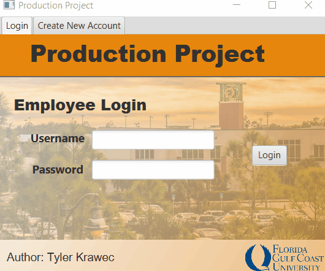

# ProductionProject
Hello! My name is Tyler Krawec, the author of this program, and I would like to thank you for checking out my repository.  
This is a project that I coded while taking Object Oriented Programming and design my junior year of college at Florida Gulf Coast University.  
It takes shape as a graphical user interface itegrated with a database that is coded in Java, JavaFX, and SQL. 
The goal of this project is to gain a greater understanding of object oriented programming and how it can be applied to a real world scenario.  
ProductionProject is a program that allows users to create and produce a digital product and save its information to a database where it can later be retrieved from. 
This program also has apassword protected login screen so that only registered users with an account may interact with, to improve the security of my program.  
I took extra time to ensure that my progam is asthetically pleasing, and required actions are explained to the user. 

## Demonstration
This is a video that illustrates my programs functionality.  

## Documentation
[JavaDoc](https://github.com/StaysTrying/ProductionProject/blob/master/docs/index-files/index-1.html)

## Diagrams

## Getting Started

## Built With

## Contributing

## Author

## License

## Acknowledgments

## History

## Key Programming Concepts Utilized

